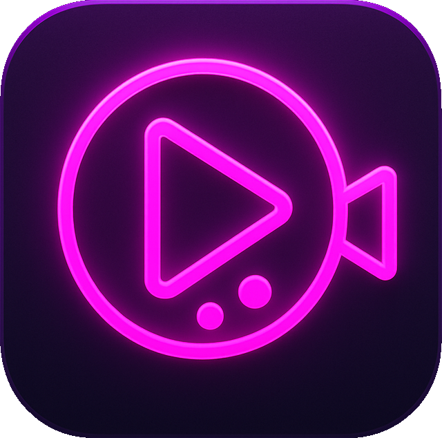

# 🎬 VuiPhim - Ứng dụng xem phim hiện đại

<p align="center">
  
</p>

<p align="center">
  
  
  
  
</p>

**VuiPhim** là một ứng dụng giải trí đa phương tiện được xây dựng bằng Flutter, tập trung vào trải nghiệm người dùng mượt mà, giao diện hiện đại và khả năng xem phim offline mạnh mẽ.

## 🌟 Tính năng nổi bật

### 📱 Giao diện & Trải nghiệm (UI/UX)
- **Glassmorphism Design:** Giao diện hiện đại với hiệu ứng blur và transparency (màn hình chính, player).
- **Haptic Feedback:** Phản hồi rung nhẹ khi tương tác (sử dụng `VibrationNative`).
- **Lazy Load Navigation:** Tối ưu hóa hiệu năng chuyển tab với `LazyLoadIndexedStack`.
- **Hiệu ứng Shimmer:** Loading state đẹp mắt với `fade_shimmer`.

### 🎥 Trình phát video thông minh
- **Custom Player:** Tích hợp đầy đủ các tính năng điều khiển.
- **Gesture Control:**
  - Vuốt dọc bên trái để chỉnh độ sáng (Brightness).
  - Vuốt dọc bên phải để chỉnh âm lượng (Volume).
- **Auto Resume:** Tự động lưu và phát tiếp vị trí đang xem dở (`ContinueWatching`).
- **Chọn tập phim:** Dễ dàng chuyển đổi tập phim đối với phim bộ.

### 💾 Tải xuống & Xem Offline
- **Download Manager:** Quản lý tiến trình tải xuống chi tiết.
- **Công nghệ FFmpeg:** Sử dụng `ffmpeg_kit_flutter_new` để xử lý và lưu trữ video chất lượng cao.
- **Quản lý kho tải:** Xem lại các phim đã tải xuống trong mục Cá nhân.

### 🔍 Khám phá & Chia sẻ
- **Home Feed:** Cập nhật liên tục Phim phổ biến (Popular), Được đánh giá cao (Top Rated), và Sắp ra mắt (Upcoming).
- **Explore Tab:** Khám phá phim đang chiếu và tìm kiếm theo danh mục.
- **Movie Details:** Thông tin chi tiết, diễn viên, và gợi ý phim liên quan.
- **Instagram Sharing:** Tính năng chia sẻ phim độc đáo lên **Instagram Story** dưới dạng Sticker với hiệu ứng background blur chuyên nghiệp (sử dụng Native Channel).

### 🔔 Thông báo & Đồng bộ (Notifications & Sync)
- **Push Notifications:** Nhận thông báo tức thì (Foreground & Background) bằng `firebase_messaging` và `flutter_local_notifications`.
- **Background Sync:** Tự động đồng bộ ngầm thể loại và cập nhật phim để dữ liệu luôn tươi mới.

## 🛠 Công nghệ sử dụng

### Core Framework & Architecture
- **Language:** Dart
- **Framework:** Flutter
- **Architecture:** Clean Architecture (Core, Data, Presentation)
- **DI:** `get_it`, `injectable`
- **Routing:** `go_router`

### State Management & Logic
- **Bloc/Cubit:** `flutter_bloc`
- **Reactive:** `rxdart` (nếu có sử dụng stream phức tạp)

### Data & Networking
- **Local Database:** `hive`, `hive_ce` (lưu trữ cache, settings, user data).
- **Networking:** `dio`, `retrofit` (gọi API TMDB & KKPhim).
- **Firebase:** `firebase_core`, `cloud_firestore`, `firebase_messaging` (config, backend, push notifications).
- **Images:** `cached_network_image` (tối ưu hóa hiển thị ảnh).

### Media & Assets
- **Video:** `video_player`, `ffmpeg_kit_flutter_new`.
- **Assets:** `flutter_svg` (vector icons), `screenshot` (tạo ảnh chia sẻ).

## 🚀 Bắt đầu

### Yêu cầu
- Flutter SDK: `^3.10.4`
- Dart SDK: tương thích
- Android Studio / VS Code

### Cài đặt

1. **Clone dự án:**
   ```bash
   git clone https://github.com/Inorista/vuiphim.git
   cd vuiphim
   ```

2. **Cài đặt dependencies:**
   ```bash
   flutter pub get
   ```

3. **Generate code (nếu cần):**
   ```bash
   flutter pub run build_runner build --delete-conflicting-outputs
   ```

4. **Cấu hình Firebase:**
   - Thêm `google-services.json` vào `android/app/`.
   - Thêm `GoogleService-Info.plist` vào `ios/Runner/`.

5. **Chạy ứng dụng:**
   ```bash
   flutter run
   ```

## 🏗️ Cấu trúc thư mục

Dự án tuân thủ cấu trúc Clean Architecture phân tách rõ ràng nhiệm vụ:

```
lib/
├── core/                 # Các thành phần cốt lõi dùng chung
│   ├── constants/       # Hằng số (API keys, Strings, Colors)
│   ├── di/              # Cấu hình Dependency Injection
│   ├── native/          # Các module giao tiếp Native (Vibration...)
│   ├── router/          # Cấu hình điều hướng (GoRouter)
│   ├── services/        # Interfaces và Implementations các services
│   └── utils/           # Tiện ích bổ trợ
├── data/                # Lớp dữ liệu
│   ├── dtos/            # Data Transfer Objects (nhận từ API)
│   ├── hive_database/   # Cấu hình và Entity cho Hive DB
│   └── resources/       # API Clients (Retrofit)
├── presentation/        # Lớp giao diện người dùng
│   ├── blocs/           # Quản lý trạng thái (Cubit/Bloc)
│   ├── screens/         # Các màn hình UI (Home, Detail, Player...)
│   └── utils/           # Widgets dùng chung và Helpers UI
└── main.dart            # Điểm khởi chạy ứng dụng
```

## 🔐 Bảo mật & Key Management
- Sử dụng `flutter_secure_storage` hoặc `Keychain` service để bảo vệ các tokens và API Keys nhạy cảm.
- API Keys được load động từ Remote Config hoặc Local Storage an toàn.

## 🤝 Đóng góp
Mọi đóng góp đều được hoan nghênh! Vui lòng tạo Pull Request hoặc mở Issue để thảo luận về các thay đổi.

## 📄 License
Dự án được phân phối dưới giấy phép MIT.

---
<p align="center">
  Developed with ❤️ by Inorista
</p>
